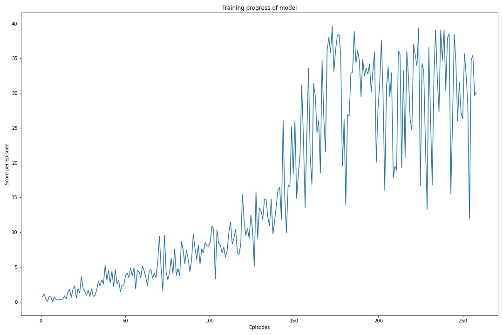

# Project Report
## Project 2 : Continuous Control

In this report, the model architecture and the steps to solve this particular project is explained. This architecture is able to solve the environment in around 257 steps as shown in the notebook.

## Project Overview

The goal of this project was to train an agent to control a double-jointed arm such that it would track a ball around. As described in the project: A reward of +0.1 is provided for each step that the agent's hand is in the goal location. Thus, the goal of your agent is to maintain its position at the target location for as many time steps as possible.

The observation space consists of 33 variables corresponding to position, rotation, velocity, and angular velocities of the arm. Each action is a vector with four numbers, corresponding to torque applicable to two joints. Every entry in the action vector should be a number between -1 and 1.

## Network Architecture

2 Fully connected layers with RELU activation was used for both actor critic. Both in the critic and actor network a Batch Normalisation was used in the first hidden layer. Two hidden layers were used with units 128/128.

## Hyperparameters

Hyperparameters used were :

```
BUFFER_SIZE = int(1e5)  # replay buffer size
BATCH_SIZE = 128        # minibatch size
GAMMA = 0.99            # discount factor
TAU = 1e-3              # for soft update of target parameters
LR_ACTOR = 2e-4         # learning rate of the actor 
LR_CRITIC = 2e-4        # learning rate of the critic
WEIGHT_DECAY = 0        # L2 weight decay

```

## Training Plot

The agent was able to solve the environment by achieving score of 30.0 over 100 consecutive episodes after 257 episodes.


## Training Output

```
Episode 100	Average Score: 3.62
Episode 200	Average Score: 20.60
Episode 257	Average Score: 30.05
Environment solved in 257 episodes!	Average Score: 30.05
```

## Future Work 

Further experimnetation on the Network architecture can be done to improve the training time.
